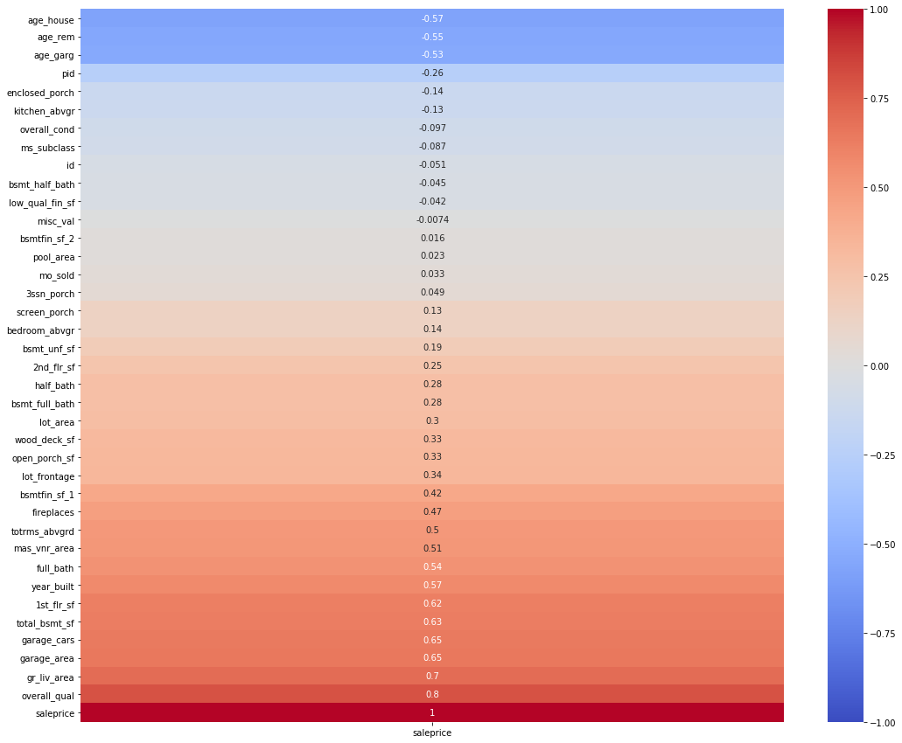
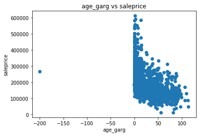
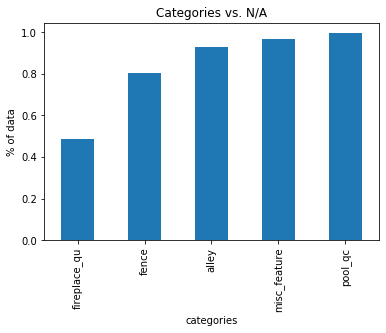
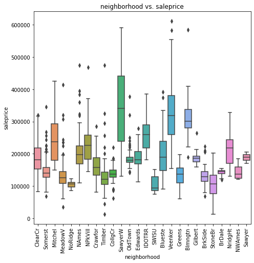
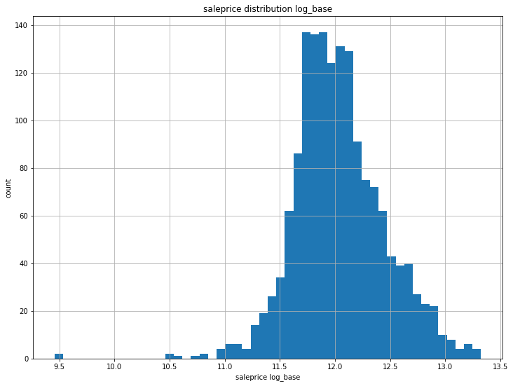

# House Price prediction model using data from Ames, Iowa. 

## Problem Statement

Given the housing data from 2006 - 2010 for the city of Ames in Iowa, analyze important features that can influence house's worth and create a regression model to predict the house price at sale. Then, submit the house price for a kaggle score. 

## Process

### 1) Data Cleaning

At start, the dataset has total of 81 features. It consist of 38 quantatitve features, 40 qualitative features and 2 identification features given by its local government. Out of the total 81 features, not all 81 will have significant influences to the house price. Thus, it will be filtered to only contain important features. 

[Data Description](http://jse.amstat.org/v19n3/decock/DataDocumentation.txt)

#### Qualitative

Qualititative contains total of 38 features. Within the 38 features, it has 3 features that were related to years, year build, year of remodeling and year garage was built. Those years were converted to age, relative to the year it was sold. 
In order to understand the correlation of each feature to the sale price, a heatmap was used. Only the features with correlatiion above 30% were kept for the model.

Final qualitative features:

Total of 19

feature|feature|feature|feature|feature
|---|---|---|---|---|
age_house|age_garg|age_rem|lot_area|wood_deck_sf
open_porch_sf|lot_frontage|bsmtfin_sf_1|fireplaces|totrms_abvgrd
mas_vnr_area|full_bath|1st_flr_sf|total_bsmt_sf|garage_cars
garage_area|gr_liv_area|overall_qual|saleprice

Each features were plotted on a scatter plots to check and remove outliers, like the scatter plots below. 

The datapoint on the left was remove beacause didn't make sense with -200 years old. 

The final step was to check for missing values. Since these features were qualitative, it must have some numeric values. 

Finding:

Features|Total Missing
|---|---|
lot_frontage|330

330 was more than 10% of the total dataset. If it was removed, it can potentially impact model accuracy. Thus, these values were filled with the mean value of its neighborhood. 

#### Quantitative

Quantitative consist of total 40 features. Each features has its own categorical values that can influence to the sale price. 
Since these were categorical values, missing values was possible. First step was to look at the features with most N/A and remove those with 50% or above.

Total of 5 features were removed. 

For the remaining features, a box plot was used on each features to show distribution of its categories and filter the features with good price variation, like the chart of neighborhood vs. saleprice.

Wide range of price variation. 

Final qualitative features:

Total of 21

feature|feature|feature|feature|feature
|---|---|---|---|---|
ms_zoning|street|lot_shape|land_contour|utilities
condition_2|bldg_type|house_style|roof_matl|mas_vnr_type
exter_qual|bsmt_qual|bsmt_cond|kitchen_qual|garage_type
garage_finish|garage_cond|sale_type|neighborhood|exterior_1st
exterior_2nd| | | |

### 2) Data Processing. Linear, Ridge and Lasso Regression 

These two sets features were combined into one dataframe with total of 40 features. 

1) Model varible setup:

    X = 40 features 
    
    y = saleprice

2) Each quantitatives feature was converted to 1's and 0's with pd.get_dummies function. It resulted in total of 150 features.

3) saleprice was log_transformed for a better distribution for the model.

4) X was split into 75/25 for training and testing dataset to check the model's prediction. 

5) model X and y to Linear Regression, Ridge and Lasso for R2 scores on CV5 folds. 

Result:

CV5_score|Train|Test|Kaggle Score
|---|---|---|---|
Linear Regression|0.914|0.856|23.83K
Ridge|0.954|0.911|23.80K
LassCV|0.947|0.920|23.28K

The scores from 3 the regression models, 2 of which with regularization, were fairly close with a slight overfit. Ridge and LassCV were able to slightly adjust the features and improved kaggle score by 1% to 2%.

## Conclusion

From the scores, the model is capable to predict house price when it is given information with these 40 features. But, the model is only valid with data from around 2006 to 2010 from Ames of Iowa, or with similar economic condition data of 2006-2010. If it is used beyond these conditions, the model will not yield good results and the model will need to be trained again. Thus, in order to improve the current model, it will need more data, iterate the features in more ways and convert the categorical values to numeric value more effectively, such as using PCA. 

